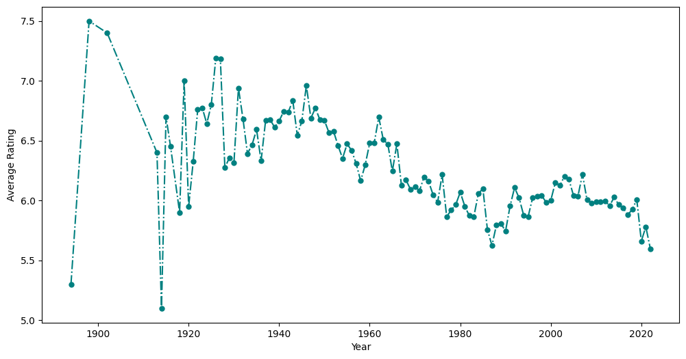
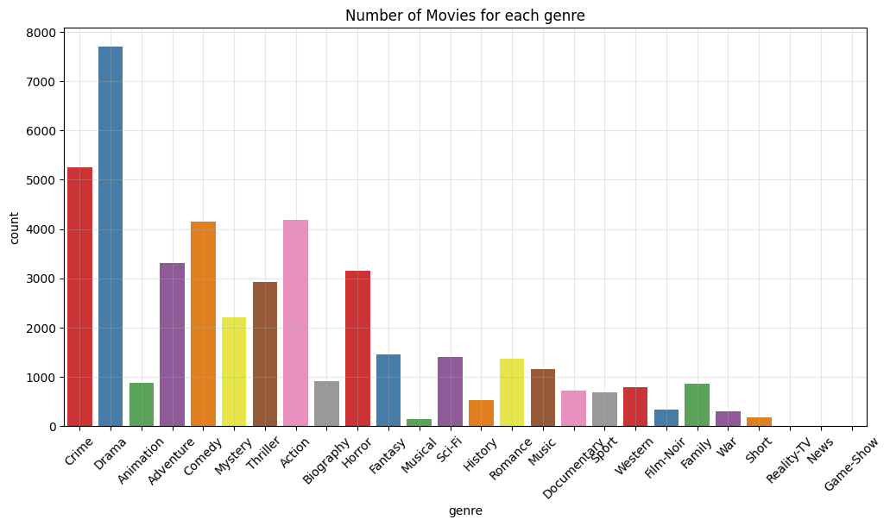
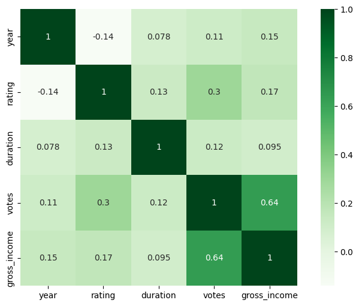

# IMDB Movies Dataset — Exploratory Data Analysis & Visualization

Business-focused EDA on an IMDB movies dataset, framed as a set of analyst questions rather than generic data exploration. The goal: turn raw scraped movie data (messy string columns, currency symbols, missing values) into clean, decision-ready insights on what drives ratings, revenue, and audience reach.

## Business Questions Answered

**Data Quality & Preparation**
- What shape is the raw data in, and what needs cleaning? (`duration`, `votes`, `gross_income` columns arrive as strings with units/symbols)
- Where are the data gaps? (missing value audit)

**Performance & Value Signals**
- Which movies are "Hidden Gems" — high rating, low vote count (undiscovered/underrated)?
- Which movies are "Overhyped" — low rating, high gross income (marketing outperforming quality)?

**Market Structure**
- What certificate/rating categories exist, and how does certificate correlate with average gross income?
- How many movies released per year — is output growing or shrinking?
- Which genres are most common, and which genres actually earn the most (avg gross)?
- Which directors and actors appear most frequently — who are the reliable/bankable names?

**Trend & Correlation Analysis**
- Does movie duration correlate with rating?
- Do votes correlate with gross income (does popularity predict revenue)?
- Are audience ratings trending up or down over the years?
- How do rating, votes, and gross income correlate with each other (full correlation heatmap)?

## Tools & Methods
- **Python**: pandas for cleaning/aggregation, matplotlib & seaborn for visualization
- **Techniques**: string cleaning & type casting, groupby/aggregation, correlation analysis, `explode()` for multi-value columns (genre, director, cast), boxplots/heatmaps/count plots for distribution and relationship analysis
- Optional: `ydata-profiling` for an automated data profiling report

## Repo Structure
```
├── movies_project.ipynb   # Full analysis notebook (run top-to-bottom, outputs included)
├── movies.csv             # Dataset
├── requirements.txt
├── README.md
├── avg_rating_per_year.png
├── genre_countplot.png
└── correlation_heatmap.png
```

## Sample Visuals

**Are ratings trending up or down over time?**


**Genre distribution — what does this dataset actually cover?**


**How do rating, votes, duration, gross income, and year relate to each other?**


## Key Takeaways
- **Critical acclaim ≠ commercial success.** Documentary, Short, and Reality-TV genres have the highest average ratings (~7.1–7.2), but Animation and Adventure earn the most on average (~$45M and ~$42M gross) — audiences pay for spectacle, not necessarily quality.
- **Popularity tracks revenue, but only moderately.** Votes and gross income have a 0.64 correlation — buzz helps, but isn't the whole story.
- **Runtime and "getting older" don't predict quality.** Duration vs. rating correlation is near-zero (0.13), and rating vs. release year is weakly *negative* (-0.14) — movies aren't getting meaningfully better (or worse) rated over time.
- **Steven Spielberg is the dataset's highest all-time grossing director** (~$4.25B total), while **Clint Eastwood is the most prolific** (34 films). Samuel L. Jackson is the most frequently cast actor (67 films).
- ⚠️ Caveat worth flagging in interviews: the "GP" certificate shows the highest average gross income, but that's an old, short-lived US rating (used only 1970–1972, before it was replaced by "PG") — almost certainly a small-sample artifact from very few old, high-grossing films, not a real signal. Good analysts call this out instead of overselling it.

## How to Run
```bash
pip install -r requirements.txt
jupyter notebook movies_project.ipynb
```
